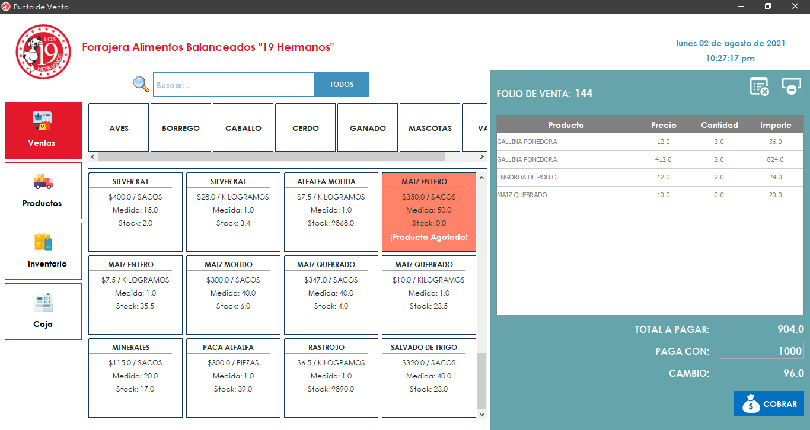
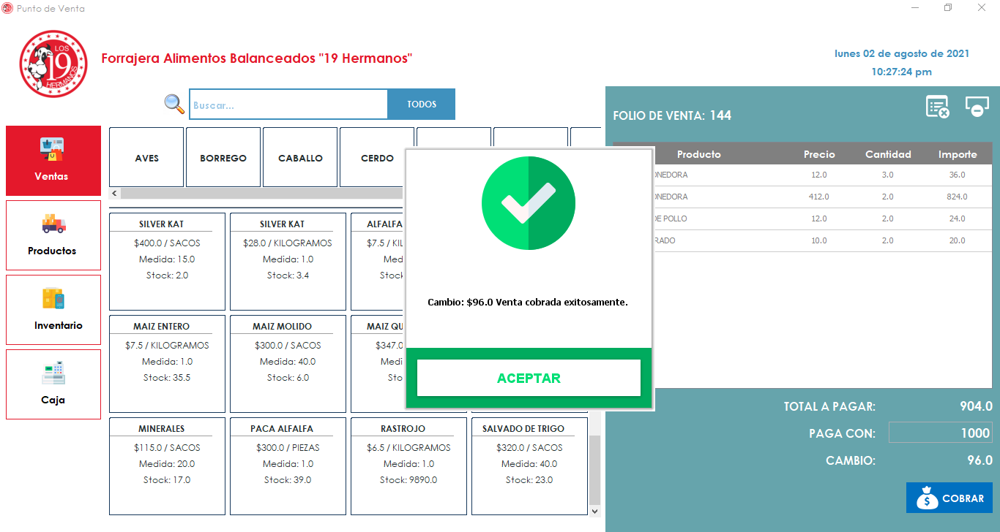
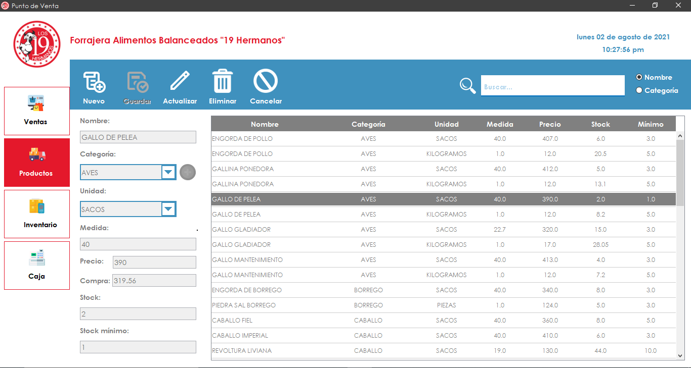
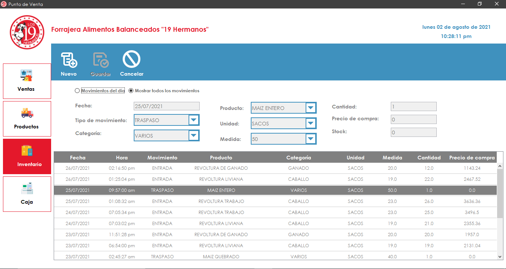
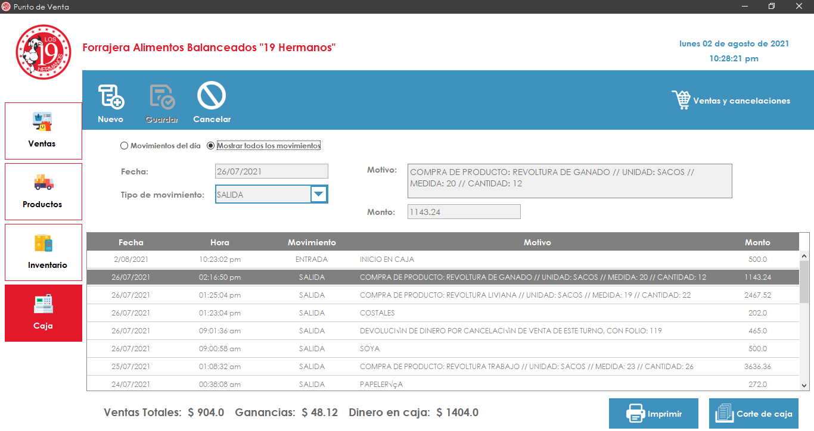
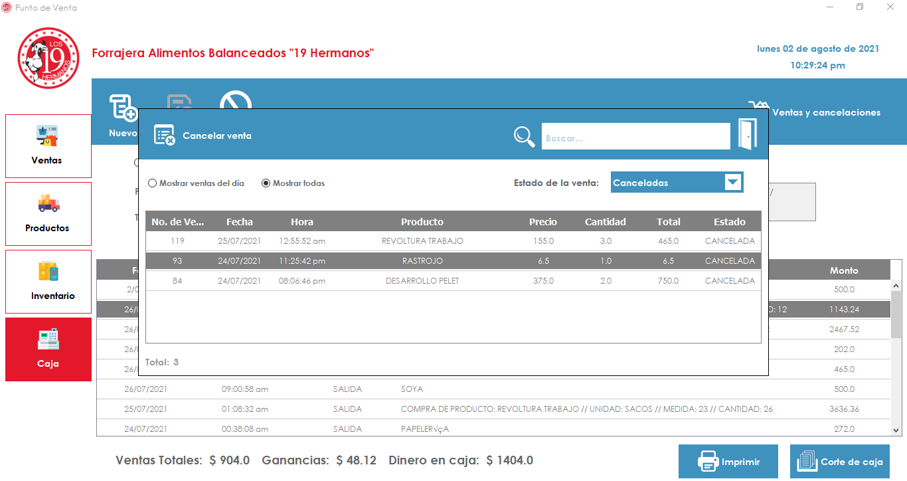
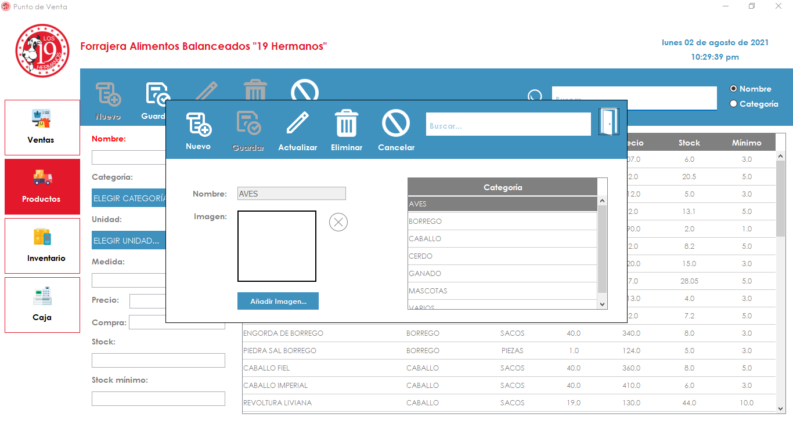

# Punto de Venta para Forrajera

Este proyecto, es un proyecto real de un Punto de Venta, fue adquirido por una microempresa.

Este proyecto, fue elaborado en base a las necesidades del cliente, agregando funcionalidades únicas, requeridas por él, así como también, se mostró un diseño original, creado por el autor y asociados. Este punto de venta es único en el mercado, no es copia de los ya existentes, totalmente funcional y mostrando únicamente las funciones que el cliente necesita.

# Autor

## Ing.Edgar Fabián Ramírez Silvestre.
## Ing. Jorge de Jesús Pérez López.
## Ing. Luis Xavier Monroy Guitérrez.

### Visita mi portafolio web para ver más proyectos y encontrar más información: [Portafolio Web](https://edgarfabian.netlify.app/)

Para el desarrollo de este proyecto, no se tomó como base ningún otro, la metodología utilizada fue una metodología tradicional, ya que el proyecto así lo demandaba:

1. Planteamiento.
2. Análisis.
3. Diseño.
4. Programación.
5. Pruebas
6. Uso y mantenimiento.

Algunas de las funciones que este sistema logra, son las siguientes:

- Apertura de caja.
- Gestión de productos.
- Gestión de inventario.
- Gestión del flujo de caja.
- Realización de venta e impresión de ticket.
- Corte de caja e impresión del corte de caja.
- Cancelación de ventas.
- Visualización de ventas realizadas, canceladas y por turnos.
- Cierre de caja.

# Copy Right &copy;

Debido a ser un sistema que fue vendido a un cliente, el código fuente pertenece al autor, sin embargo, no puede ser compartido debido a las características con las que cuenta este proyecto. Si desea tener acceso a una demostración, por favor contacte al autor.

Si desea un sistema similar, o de cualquier tipo, puede contactar al autor para hacer una cotización.

Este proyecto puede ser adaptado a cualquier negocio, inclusive a **Proyectos Escolares**, para más información contacte al autor.

Al final, en este mismo archivo, podrá encontrar algunas imágenes que muestran el funcionamiento del sistema, donde podrá ver la personalización utilizada en un diseño único, amigable y totalmente funcional.

 

---

## Contact

### [GitHub](https://github.com/EdgarFabianRamirezSilvestre)

### [LinkedIn](https://www.linkedin.com/in/edgar-fabian-ramirez-silvestre-06529a221/)

### Find my contact email on my website [Edgar Fabián Portfolio](https://edgarfabian.netlify.app/).

 

---

